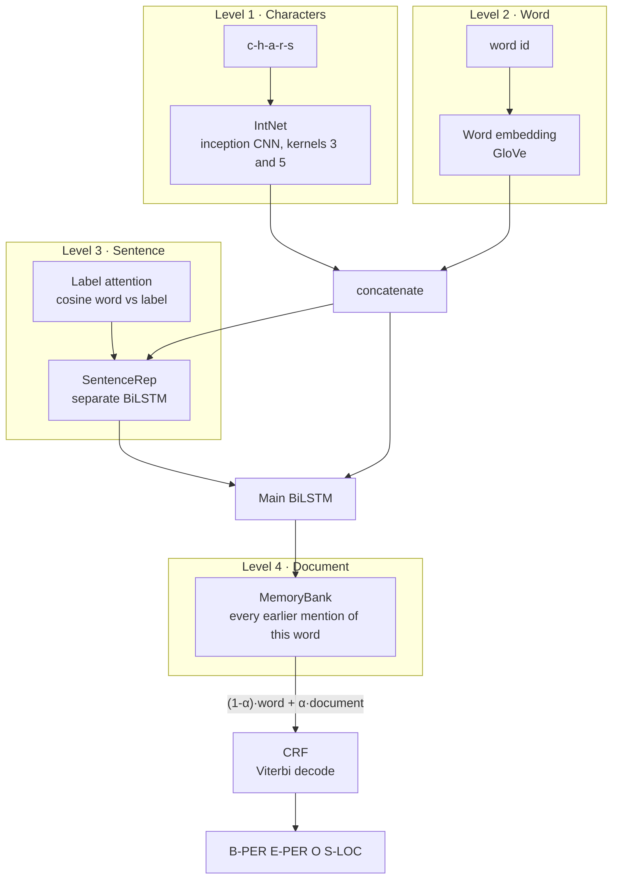
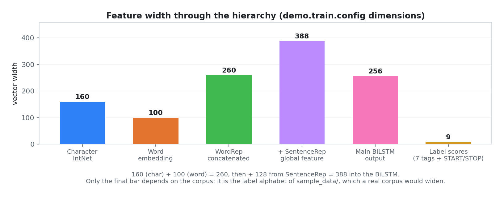
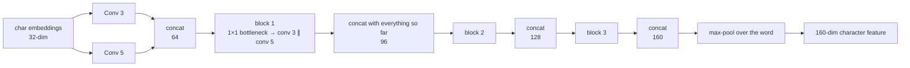
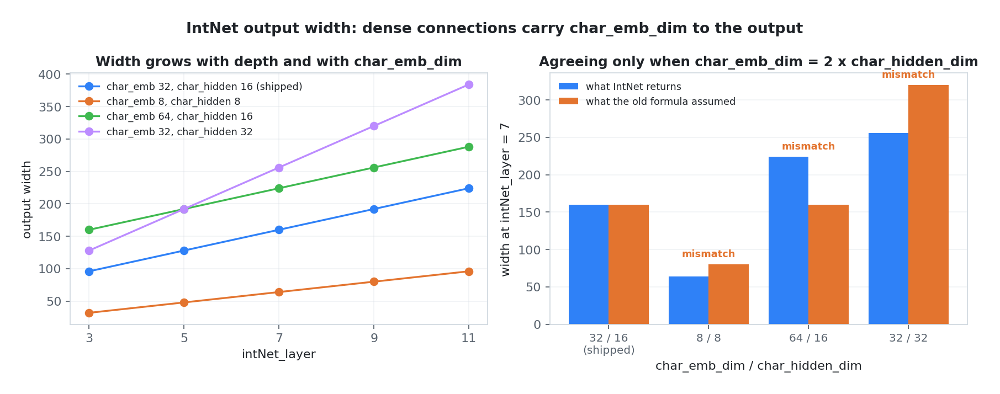
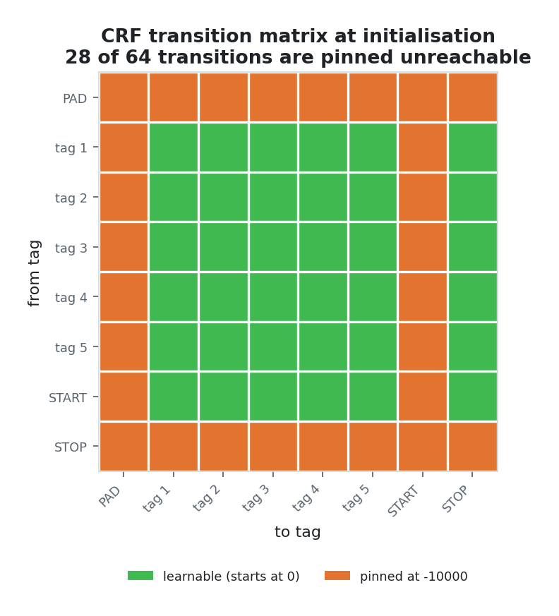
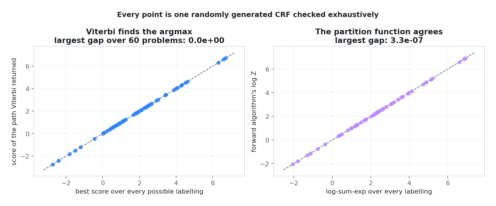
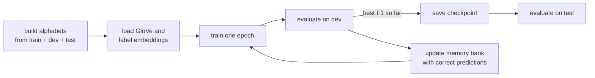
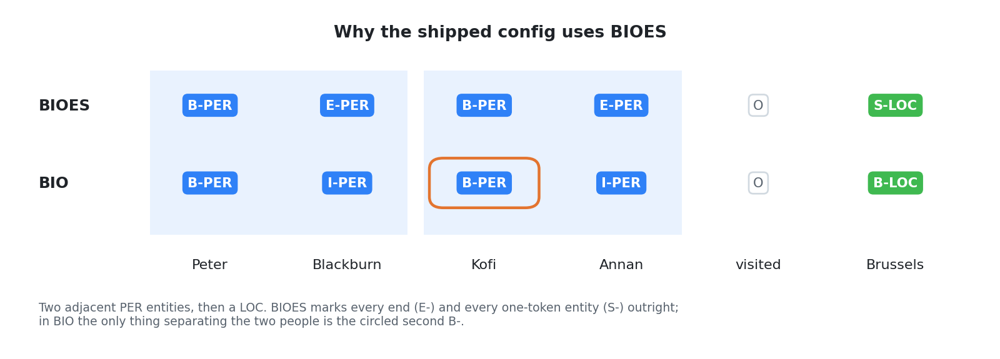
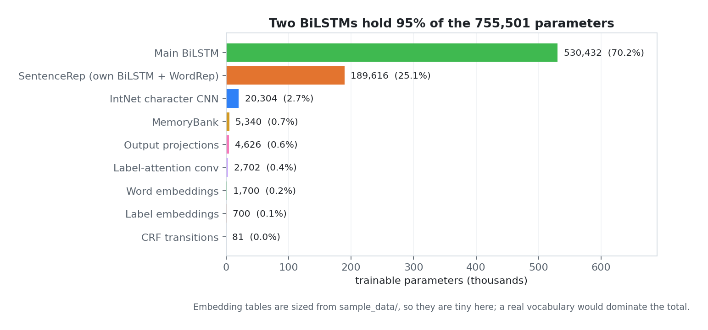

# Hierarchical Contextualized NER

A four-level neural architecture for **named entity recognition** — characters,
words, sentences, and whole documents — implementing Luo, Xiao and Zhao's
*Hierarchical Contextualized Representation for Named Entity Recognition*
(AAAI 2020) on top of the NCRF++ sequence-labeling framework.

> **What this repository is.** It is a study of an existing research codebase,
> not an independent reimplementation. The model code is derived from published
> work by other authors; see [NOTICE](NOTICE) for the full provenance. What was
> added here is a **190-test suite**, corrected documentation, and the fixes
> listed under [What changed](#what-changed) — including six defects that
> stopped the code running at all on a current PyTorch.

---

## The idea in one picture

Most NER models stop at the sentence. This one keeps widening the context: the
same word is described four times over, at four different scales, and the four
descriptions are concatenated before the tagger ever sees them.



Each level answers a question the level below cannot:

| Level | Module | Question it answers |
|---|---|---|
| Characters | `IntNet` | Does this token *look* like a name? Capitalisation, suffixes, shape — this is what generalises to words never seen in training. |
| Word | `WordRep` | What does this token usually mean? |
| Sentence | `SentenceRep` + label attention | What is this sentence about, and which labels does its vocabulary lean toward? |
| Document | `MemoryBank` | How was this same word tagged earlier in the document? A token ambiguous in isolation is often unambiguous on its second mention. |
| Decoding | `CRF` | Which *sequence* of labels is jointly best? `B-PER` cannot be followed by `S-LOC`; the CRF learns those constraints instead of tagging each token independently. |

Concatenation is the whole mechanism, so the widths add up in a way that is easy
to see and was easy to get wrong:

<picture>
  <source media="(prefers-color-scheme: dark)" srcset="docs/assets/dimension-flow-dark.png">
  
</picture>

Every number in that chart is measured from an instantiated model, not written
down by hand. Regenerate it with `python scripts/make_figures.py`.

---

## Why each piece exists

### IntNet — reading the shape of a word

A single convolution width sees one size of pattern. IntNet runs kernels of
width 3 and 5 side by side and stacks the result with **dense connections**, so
every block sees every earlier block's output:



That last width is the one thing about IntNet worth remembering, because it is
not `char_hidden_dim`:

```
output_dim = char_emb_dim × kernel_type + n_blocks × char_hidden_dim × kernel_type
           = 32 × 2 + 3 × 16 × 2
           = 160
```

The dense connections carry the initial embedding-width convolutions all the way
to the output, so `char_emb_dim` appears in the total. Downstream modules read
`IntNet.output_dim` instead of re-deriving it — and the right-hand panel below is
exactly why:

<picture>
  <source media="(prefers-color-scheme: dark)" srcset="docs/assets/intnet-width-dark.png">
  
</picture>

The blue bars are what IntNet returns; the orange bars are what `SentenceRep` and
`WordSequence` used to assume. They coincide only in the shipped configuration.
Any other ratio produced a model whose BiLSTM was sized for a tensor that never
arrived.

### MemoryBank — the document-level trick

The bank holds one slot per word *type*. After each epoch, every word the model
tagged **correctly** writes its hidden state into its slot. On the next pass, a
word retrieves the states of its own earlier occurrences, attends over them, and
mixes the result back in:

```
output = (1 − α) · word_representation + α · document_representation      α = 0.3
```

The retrieval is masked so a word can only attend to *other* occurrences, never
to itself at the current position.

### CRF — tagging the sequence, not the tokens

Per-token softmax will happily emit `B-PER` followed by `S-LOC`. The CRF scores
whole sequences using a learned transition matrix and picks the best one by
Viterbi. Transitions into `START`, out of `STOP`, and anything touching the
padding index are pinned at `-10000`, so those paths are unreachable before a
single gradient step:

<picture>
  <source media="(prefers-color-scheme: dark)" srcset="docs/assets/crf-transitions-dark.png">
  
</picture>

The tests verify the decoder the strong way rather than by asserting shapes. For
short sequences and a small tag set, *every* possible labelling can be enumerated
by brute force, so Viterbi's answer is required to be the argmax over that full
enumeration, and the forward algorithm's partition function is checked against
the brute-force log-sum-exp:

<picture>
  <source media="(prefers-color-scheme: dark)" srcset="docs/assets/crf-verification-dark.png">
  
</picture>

Sixty randomly generated CRFs, each solved both ways. Viterbi's path matches the
exhaustive optimum exactly; the partition function agrees to floating-point
noise.

---

## Repository layout

```
.
├── main.py                     Training, evaluation and decoding pipeline
├── demo.train.config           Training configuration
├── demo.test.config            Decoding configuration
├── model/                      The network      → model/README.md
│   ├── seqlabel.py             Top-level model: loss and decode
│   ├── wordsequence.py         Combines the four levels
│   ├── wordrep.py              Word + char + label-similarity features
│   ├── IntNet.py               Inception character CNN
│   ├── SentenceRep.py          Sentence-level extractor
│   ├── MemoryBank.py           Document-level memory
│   └── crf.py                  CRF: forward, Viterbi, n-best
├── utils/                      Data and metrics  → utils/README.md
│   ├── data.py                 Config parsing, alphabets, instances
│   ├── alphabet.py             Token ↔ index mapping
│   ├── functions.py            CoNLL reading, pretrained embeddings
│   ├── metric.py               Entity-level precision, recall, F1
│   └── tagSchemeConverter.py   IOB ↔ BIO ↔ BIOES
├── BERT/                       Google's BERT, vendored → BERT/README.md
├── sample_data/                Four illustrative sentences → sample_data/README.md
├── scripts/make_figures.py     Regenerates every figure in docs/assets/
├── docs/assets/                Generated figures, light and dark
├── tests/                      190 tests
├── NOTICE                      Provenance and attribution
└── requirements.txt
```

---

## Running it

Verified on **Python 3.11.9** with **PyTorch 2.5.1** and **NumPy 1.25.2**.

```bash
pip install -r requirements.txt
```

### The tests need no data and no download

```bash
python -m pytest
```

190 tests, a few seconds. They cover metric and span extraction, tag-scheme
conversion, the alphabet, the data reader, IntNet's dimensions, the CRF against
brute force, the BERT alignment reducers, an end-to-end train-and-decode run on
the four sentences in `sample_data/`, and every number quoted in this README.

### Training

Training needs the real corpus, which is not in this repository — see
[sample_data/README.md](sample_data/README.md).

```bash
python main.py --config demo.train.config
```



Checkpoints land at `<model_dir>.<epoch>.model` alongside `<model_dir>.dset`,
which pickles the alphabets and settings. Both are needed to decode later.

### Decoding with a trained model

```bash
python main.py --config demo.test.config
```

A checkpoint was published alongside the earlier version of this repository:
[lstmcrf.model](https://drive.google.com/drive/folders/1G3kN1WsPJDVk9FdVUtIdv7DXd55p3yv0?usp=sharing).
Which configuration produced it, and what it scores, are not recorded anywhere in
this repository, so neither is claimed here. It also predates the fixes below, so
its `.dset` companion may not load against the current code.

### Converting tag schemes

```bash
python utils/tagSchemeConverter.py BIO2BIOES input.txt output.txt
```

`IOB2BIO`, `BIO2BIOES`, `BIOES2BIO` and `IOB2BIOES` are all available. BIOES is
what the shipped config expects, and this is why:

<picture>
  <source media="(prefers-color-scheme: dark)" srcset="docs/assets/tag-schemes-dark.png">
  
</picture>

The BIOES row in that figure is produced by running the converter, not typed out.

### Optional: BERT features

```bash
cd BERT && bash run.sh input.txt output.emb /path/to/bert_base
```

`extract_features.py`, `modeling.py` and `tokenization.py` are Google's
**TensorFlow 1.x** release and will not import under TensorFlow 2. They are kept
for reference; `get_aligned_bert_emb.py`, which collapses word-pieces back to
tokens (`first`, `mean` or `max`), is pure Python and is tested.

---

## Where the parameters live

<picture>
  <source media="(prefers-color-scheme: dark)" srcset="docs/assets/parameter-budget-dark.png">
  
</picture>

Two BiLSTMs account for 95% of the weights — the main one and the entirely
separate one inside `SentenceRep`, which carries its own `WordRep` and therefore
its own IntNet. That duplication is deliberate: the sentence representation has
to exist before the main BiLSTM runs, so it cannot reuse the main pathway's
features.

The embedding tables are small only because this count uses the sample file's
vocabulary. With a real corpus they dominate everything else.

---

## Configuration

Full tables live in the per-directory READMEs; these are the settings that
actually change behaviour.

| Parameter | Default | What it does |
|---|---|---|
| `word_emb_dim` | 100 | Word embedding width; must match the GloVe file |
| `char_emb_dim` | 32 | Character embedding width — also widens IntNet's output |
| `char_hidden_dim` | 16 | IntNet block width |
| `intNet_layer` | 7 | `(7-1)//2 = 3` inception blocks |
| `hidden_dim` | 256 | Main BiLSTM, split across both directions |
| `global_hidden_dim` | 128 | Sentence-level BiLSTM |
| `mem_bank_alpha` | 0.3 | Weight on the document-level representation |
| `use_crf` | True | CRF decoding rather than per-token softmax |
| `learning_rate` / `lr_decay` | 0.015 / 0.05 | SGD, decayed as `lr / (1 + decay × epoch)` |
| `iteration` | 70 | Epochs |

Both config files are commented line by line.

---

## What changed

Six defects were found and fixed. Each has a test that fails without the fix.

| # | Where | What was wrong |
|---|---|---|
| 1 | `main.py`, `model/crf.py` | Masks were built as `ByteTensor`. `masked_select` has required `BoolTensor` since PyTorch 1.2, so **every training run died** at the first document-level step with `masked_select: expected BoolTensor for mask`. |
| 2 | `model/SentenceRep.py`, `model/wordsequence.py` | Both re-derived IntNet's output width with `char_hidden_dim × 2 × kernel_type` where the code produces `char_emb_dim × kernel_type`. The two agree only when `char_emb_dim == 2 × char_hidden_dim`. The shipped config happens to satisfy that; any other ratio crashed with an opaque matmul error several layers away. Both now read `IntNet.output_dim`. |
| 3 | `model/IntNet.py` | `get_all_hiddens`, and therefore `forward`, called `self.char_cnn` — an attribute never created. Any use of the module as a plain `nn.Module` raised `AttributeError`. The inception stack is now shared between the pooled and per-position accessors. |
| 4 | `model/crf.py` | `CRF.forward` passed one argument to `_viterbi_decode`, which takes two. |
| 5 | `utils/alphabet.py` | `save` and `load` referenced `self.__name`, name-mangled to an attribute that does not exist, so **both raised unconditionally**. `save` also swallowed every exception behind a malformed message. |
| 6 | `model/seqlabel.py` | The constructor did `data.label_alphabet_size += 2`, mutating shared state. Building a second model from the same `Data` produced one two tags wider, and the two could not share a checkpoint. Now derived from the alphabet and assigned. |

Smaller corrections, same rule — each is pinned by a test:

- `utils/data.py` — `save` did not create its parent directory, so a fresh clone
  crashed with `FileNotFoundError: 'result/lstmcrf.dset'` at the end of the first
  epoch, after all of that epoch's work.
- `utils/functions.py` — `read_instance`'s `word_mat` and `mem_mat` defaulted to
  `None` while the body appended to both unconditionally.
- `utils/tagSchemeConverter.py` — sentences were flushed only on a blank line, so
  all four converters **silently dropped the last sentence** of a file that did
  not end with one.
- `BERT/get_aligned_bert_emb.py` — both reducers accumulated into their first
  argument, corrupting the caller's word-piece buffer; calling either twice on
  the same input gave different answers.
- `main.py` — `torch.load` now passes `map_location` and `weights_only=True`, so
  a GPU-trained checkpoint loads on a CPU-only machine.

Attribution, restored:

- `BERT/modeling.py`, `BERT/tokenization.py` and `BERT/extract_features.py` had
  their `Copyright 2018 The Google AI Language Team Authors` headers stripped in
  an earlier commit. Apache 2.0 section 4 requires them to be retained; they are
  back, verbatim.
- `BERT/LICENSE` had been rewritten to claim copyright over Google's code. It
  now carries Google's notice again.
- [NOTICE](NOTICE) records the full chain — NCRF++, the AAAI 2020 paper, Google
  BERT, CoNLL-2003 — and the root `LICENSE` lists every copyright holder.

Nothing in the model's numerical behaviour changed. On the shipped configuration
the training loss after each epoch is identical, to the last decimal place, to
what it was before any of this: `24.942479610443115` then `24.315837860107422`.

---

## What is not claimed here

Following the same rule as the rest of this portfolio — never state a number the
tests do not pin:

- **No benchmark scores are reported.** The paper reports state-of-the-art F1 on
  CoNLL-2003 and OntoNotes. This repository has never been run on either: the
  corpora are licensed and absent, as are the GloVe and label embedding files.
  Quoting the paper's numbers as though they came from this code would be
  fabrication.
- The four sentences in `sample_data/` are enough to prove the pipeline runs.
  They are far too few to train anything, and the F1 values a smoke run prints
  are meaningless.
- `_viterbi_decode` returns `None` in its path-score slot; only the n-best
  decoder computes path scores. `SeqLabel` discards the slot, so nothing
  downstream depends on it.

---

## Further reading

| Document | Contents |
|---|---|
| [model/README.md](model/README.md) | Every module, its tensor shapes, and the data flow between them |
| [utils/README.md](utils/README.md) | Data pipeline, alphabets, and how the metrics are computed |
| [BERT/README.md](BERT/README.md) | The BERT feature-extraction path and word-piece alignment |
| [sample_data/README.md](sample_data/README.md) | Data format, tag schemes, and where to get the real corpus |
| [NOTICE](NOTICE) | Provenance and attribution |

---

## Citation

```bibtex
@inproceedings{luo2020hierarchical,
  title={Hierarchical Contextualized Representation for Named Entity Recognition},
  author={Luo, Ying and Xiao, Fengshun and Zhao, Hai},
  booktitle={Proceedings of the AAAI Conference on Artificial Intelligence},
  year={2020}
}

@inproceedings{yang2018ncrf,
  title={{NCRF++}: An Open-source Neural Sequence Labeling Toolkit},
  author={Yang, Jie and Zhang, Yue},
  booktitle={Proceedings of ACL 2018, System Demonstrations},
  year={2018}
}
```

## License

Apache 2.0 — see [LICENSE](LICENSE) and [NOTICE](NOTICE).
